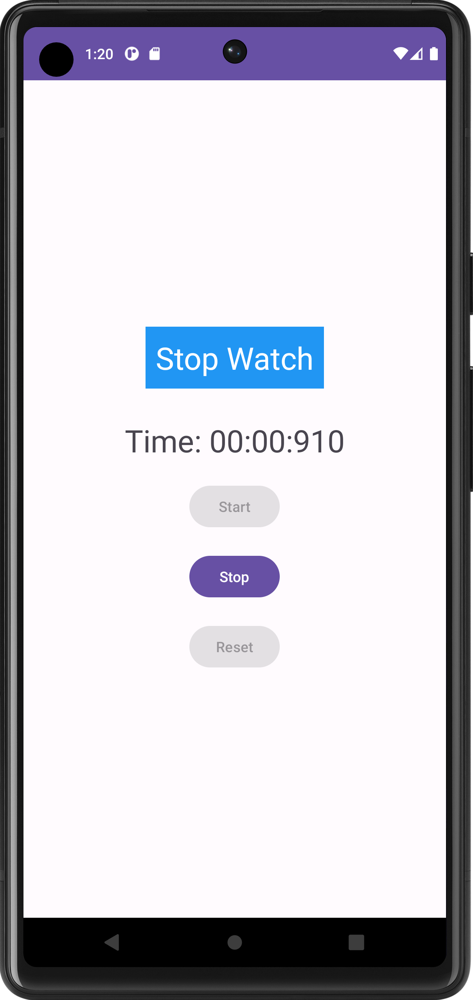
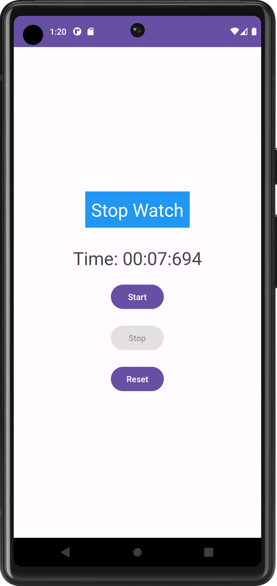
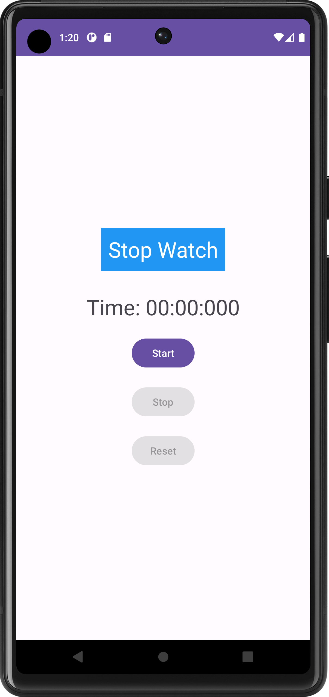

# Android Stopwatch App


This is a simple Android stopwatch app that measures the time elapsed between its activation and deactivation. The app allows you to start, stop, and reset the stopwatch.

## Features

- **Start:** Begin measuring time.
- **Stop:** Pause the measurement.
- **Reset:** Reset the stopwatch to zero.
- Displays time with milliseconds.

## Screenshots





## Getting Started

To run this app on your Android device or emulator, follow these steps:

1. Clone this repository to your local machine.

   ```bash
   git clone https://github.com/yourusername/stopwatch-app.git
